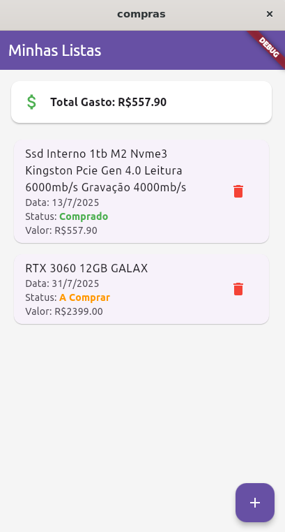
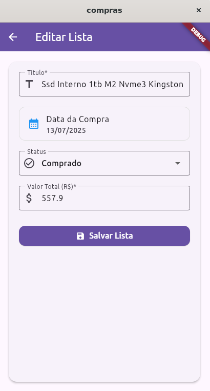

<h1 align="center" style="font-weight: bold;">Lista de compras 🛒</h1>

  
  

  <b>Aplicativo de lista de compras desenvolvido durante a disciplina de Tópicos Especiais I.</b>

<h2 align="center">Tela inicial</h2>

<h2 align="center">Tela edição/criação de compras</h2>

